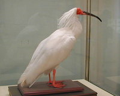

# Toki

SOAP Stubber for APIs generated by [WSDL2Swift](https://github.com/banjun/WSDL2Swift), written in Swift on top of [Mockingjay](https://github.com/kylef/Mockingjay) stubbing library.
 
 

> An image of stu~~bb~~ffed Toki
 
 Toki is one of the Threatened Birds in Japan.

[](https://travis-ci.org/banjun/Toki)
[](http://cocoapods.org/pods/Toki)
[](http://cocoapods.org/pods/Toki)
[](http://cocoapods.org/pods/Toki)

## Notes for WSDL2ObjC (not WSDL2Swift)

Toki has dropped support for WSDL2ObjC. Toki is for WSDL2Swift as of 0.5.0.
use former version of Toki if you use with WSDL2ObjC.

## Usage

See [example testcases](https://github.com/banjun/Toki/blob/master/Example/Tests/Tests.swift).

## Requirements

## Installation

Toki is available through [CocoaPods](http://cocoapods.org). To install
it, simply add the following line to your Podfile:

```ruby
pod "Toki"
```

## Author

@banjun

## License

Toki is available under the MIT license. See the LICENSE file for more info.
